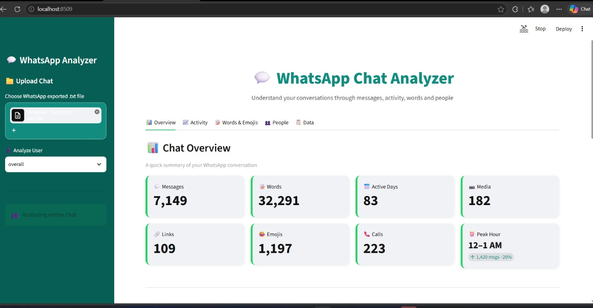

💬 WhatsApp Chat Analyzer

An interactive web application built with Python and Streamlit to analyze, visualize, and extract deep insights from WhatsApp chat exports.

🚀 Features

📊 Top-Level Statistics: Total messages, total words, media shared, and links sent.

📅 Timeline Analysis: Monthly and daily activity timelines to find peak usage periods.

⏰ Activity Map: Busiest days of the week and busiest hours of the day.

📈 Weekly Activity Heatmap: Understand chat patterns across different days and times.

☁️ Word Cloud: Visual representation of the most frequently used words (with stop words filtering).

🏆 Most Busy Users: Identify the most active participants in group chats (with percentage contributions).

🔗 Emoji Analysis: Breakdown of the most commonly used emojis with visual distribution.

🔍 Sentiment / Word Search: Look up specific words or search user-specific statistics.
## 📸 App Screenshots

  | 

🛠️ Tech Stack

Language: Python 3.x

Framework: Streamlit

Data Manipulation & Analysis: Pandas, NumPy

Visualization: Matplotlib, Seaborn

NLP & Text Processing: Urlextract, Emoji, WordCloud

📂 Project Structure

whatsapp-chat-analyzer/
│
├── .streamlit/
│   └── config.toml     # Streamlit theme and custom styling configuration
├── app.py              # Main Streamlit application
├── preprocessor.py     # Data cleaning and parsing logic
├── helper.py           # Statistical and plotting functions
├── requirements.txt    # Required Python packages
└── README.md           # Project documentation

⚙️ Installation & Setup

Follow these steps to run the project locally on your machine:

Clone the repository:

git clone https://github.com/your-username/whatsapp-chat-analyzer.git
cd whatsapp-chat-analyzer

Create a virtual environment (recommended):

python -m venv venv
source venv/bin/activate  # On Windows use: venv\Scripts\activate

Install dependencies:

pip install -r requirements.txt

Run the Streamlit app:

streamlit run app.py

🎨 Custom Theme Configuration (.streamlit/config.toml)

This project includes custom styling inspired by WhatsApp's official branding. You can customize the look via .streamlit/config.toml:

[theme]
primaryColor = "#25D366"          # WhatsApp Green
backgroundColor = "#FFFFFF"       # Main background color
secondaryBackgroundColor = "#F0F2F6" # Sidebar and card background
textColor = "#262730"             # Text color
font = "sans serif"               # Font style

📱 How to Export Your WhatsApp Chat

Open individual or group chat on WhatsApp.

Tap on Three Dots (Menu) -> More -> Export chat.

Choose Without Media.

Upload the generated .txt file into the web app!

🤝 Contributing

Contributions, issues, and feature requests are welcome! Feel free to check the issues page.

📝 License

This project is open-source and available under the MIT License.
